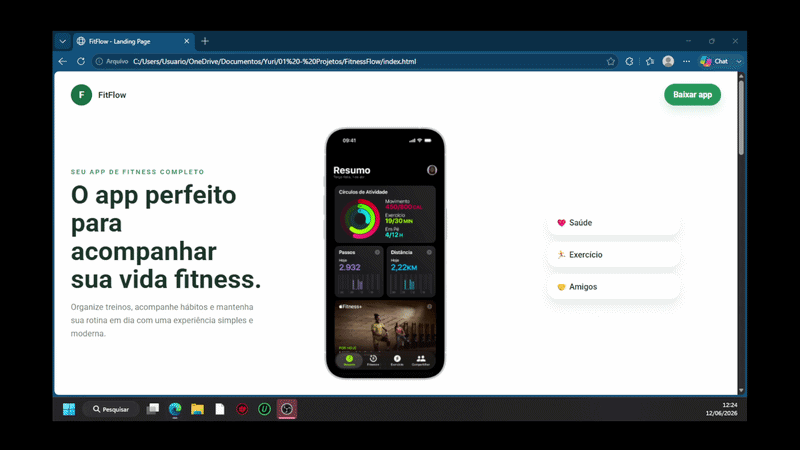
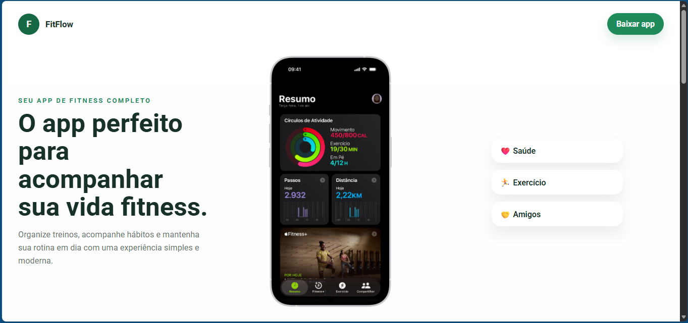
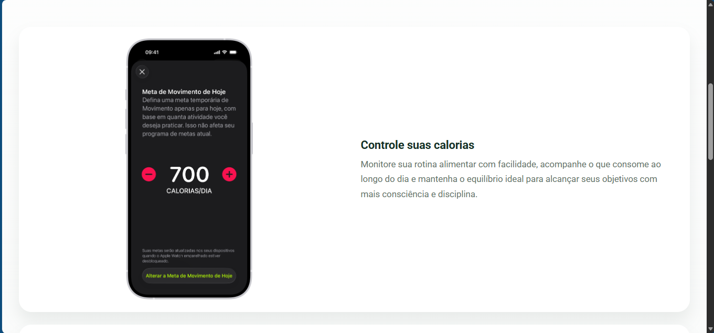
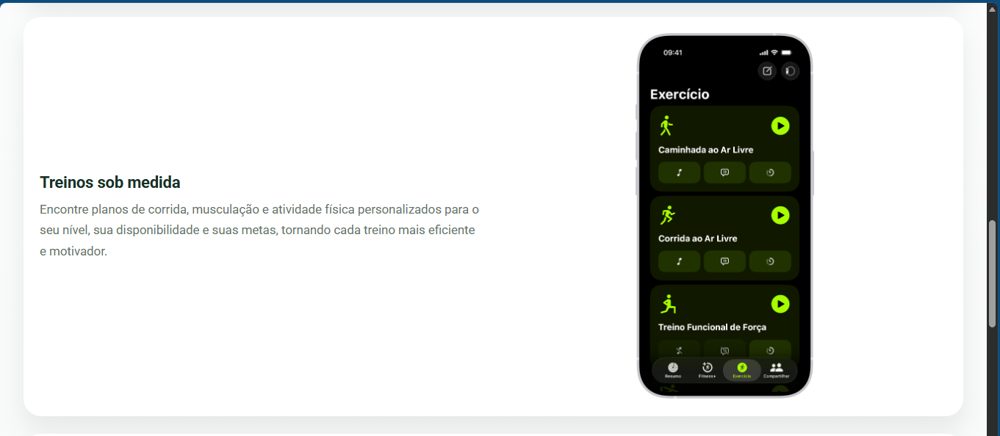
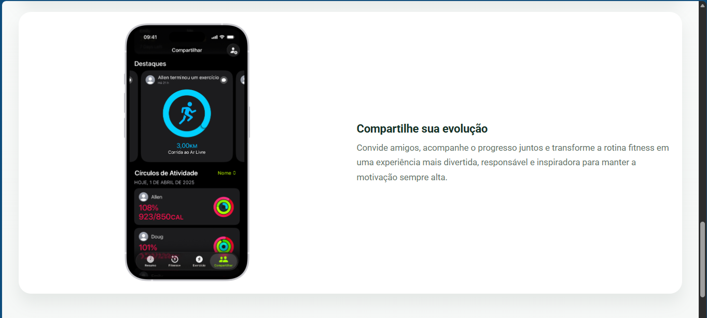

# 💪 FitnessFlow

Landing page desenvolvida como resultado dos primeiros passos da jornada **Fullstack com IA** na plataforma **B7Web**, com o professor Bonieky. A página apresenta as funcionalidades de um app de treino fictício chamado **FitFlow**, com design clean, sofisticado e responsivo, desenvolvida com o apoio do **GitHub Copilot** a partir de um plano estruturado pelo próprio desenvolvedor.

> Projeto desenvolvido individualmente com foco na aplicação de conceitos de desenvolvimento front-end, design de interfaces e uso de IA assistiva para geração de código.

---

## 📸 Demonstração

### 🎥 Demonstração da Aplicação
 

 

### 🏠 Seção Hero



---

### 🔥 Controle suas Calorias



---

### 🏃 Treinos sob Medida



---

### 🤝 Compartilhe sua Evolução



---

## 🎯 Objetivo

Desenvolver uma landing page para um app de fitness fictício, aplicando conceitos de design responsivo, semântica HTML e boas práticas de CSS — utilizando o GitHub Copilot como ferramenta assistiva a partir de um plano elaborado previamente, praticando o fluxo de desenvolvimento orientado por IA.

---

## ⚙️ Seções da Página

- **Header** — logo em CSS puro e botão de download
- **Hero** — headline, print do app em destaque e lista de pontos-chave
- **Funcionalidades** — três seções alternadas entre imagem e texto descritivo
- **CTA** — chamada para download com destaque "Totalmente gratuito"
- **Rodapé** — créditos da página

---

## 🛠️ Tecnologias Utilizadas

- HTML5
- CSS3
- Google Fonts (Roboto)
- GitHub Copilot (IA assistiva para geração de código)

---

## 🧠 Conceitos Aplicados

- Semântica HTML5
- Variáveis CSS (Custom Properties)
- Flexbox e CSS Grid
- Design responsivo com Media Queries
- Layout alternado de conteúdo (imagem/texto)
- Tipografia com Google Fonts
- Logo construída com CSS puro
- Desenvolvimento assistido por IA com GitHub Copilot
- Planejamento de projeto antes do desenvolvimento

---

## 📂 Estrutura do Projeto

```plaintext
FitnessFlow/
│
├── index.html
├── style.css
│
├── images/
│   ├── print_1.png
│   ├── print_2.png
│   ├── print_3.png
│   └── print_4.png
│
└── docs/
    ├── plan.md
    └── images/
        ├── hero-section.png
        ├── feature1.png
        ├── feature2.png
        └── feature3.png
```

---

## 🚀 Como Executar

### 1️⃣ Clone o repositório

```bash
git clone <URL_DO_REPOSITORIO>
```

---

### 2️⃣ Abra no navegador

Abra o arquivo `index.html` diretamente no navegador ou utilize a extensão **Live Server** no VS Code para uma melhor experiência de desenvolvimento.

---

## 📈 Melhorias Futuras

- Adicionar animações de entrada nas seções com scroll
- Implementar responsividade para telas menores que 360px
- Adicionar modo escuro
- Criar versão interativa com JavaScript (menu mobile, smooth scroll)

---

## 👨‍💻 Autor

Yuri Rodrigues Lombardi

🔗 LinkedIn: https://linkedin.com/in/yuri-rodrigues-lombardi
💻 GitHub: https://github.com/yuriRLombardi
